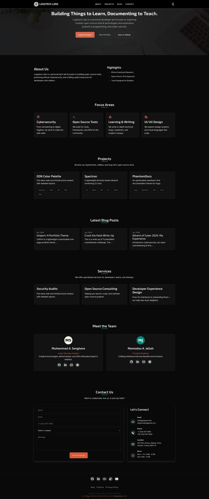
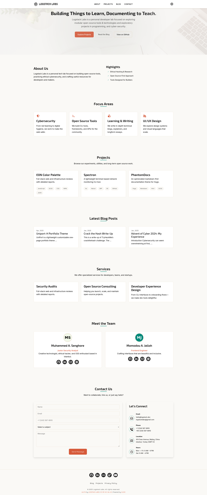

<div align="center">

<h1>Alvyn Theme <small>v1.0.0</small></h1>


     

## A **_"Minimalist"_** HUGO landing page theme

</div>


## 🚀 Features

- RSS Integration Support.
- Google Analytics support.
- Dark & Light mode support.
- SEO and accessibility friendly
- Easy setup, configuration, & customization.
- Clean, Minimalist, Lightweight, & Responsive.

## 📸 Screenshots & Demo
<ul>
    <li>
        <a href="https://logstack.dev" target="_blank">logstack.dev</a>
    </li>
    <li>
        <details>
            <summary>Screenshot dark mode</summary>
            
        </details>
    </li>
    <li>
        <details>
            <summary>Screenshot light mode</summary>
            
        </details>
    </li>
</ul>


## 🔧 Quick Start

> **Prerequisites**: Git, dart-sass, Hugo

- In your site's root directory run the following commands below

```bash
git init
```
```bash
git submodule add https://github.com/logstacklabs/alvyn.git themes/alvyn

# Or run: git clone https://github.com/logstacklabs/alvyn.git themes/alvyn
```
```bash
echo 'alvyn' >> hugo.toml
```
```bash
cd themes/alvyn && npm install
```
```bash
npm run preview

# Runs: hugo server.
```
```bash
npm run clean

# Runs: rm -r .hugo_build.lock resources public && clear.
# deletes the `public`, `resources`, and `.hugo_build.lock` files.
```
```bash
npm run build

# Runs: hugo.
```
Then Preview your site at [localhost:1313](http://localhost:1313).

## 🍰 Contributing
[](CODE_OF_CONDUCT.md)
- Check out this guide [link](https://daily.dev/blog/how-to-contribute-to-open-source-github-repositories)
- Also makesure to record your changes in the [changelog](CHANGELOG.md) file.


## 🛡️ License

This project is licensed under the Creative Commons Attribution-NonCommercial-ShareAlike 4.0 International License (CC BY-NC-SA 4.0).

[](https://creativecommons.org/licenses/by-nc-sa/4.0/)

## 🙏 Acknowledgements
- **[HUGO](https://gohugo.io)**
- **[Canva](https://canva.com)**
- **[Coolors](https://coolors.co/)**
- **[Web3Forms](https://web3forms.com)**
- **[Font Awesome](https://fontawesome.com/)**
- **[Google Fonts](https://fonts.google.com)**
- **[EON Color Palette](https://logstacklabs.github.io/eon-swatches/)**


### 💝 Support

For any issues or questions, please [open an issue](https://github.com/logstacklabs/muxel/issues) on GitHub.

---

<!--h4>🧐**Designed with ❤️ by [LSL](https://logstack.dev)**</h4-->
